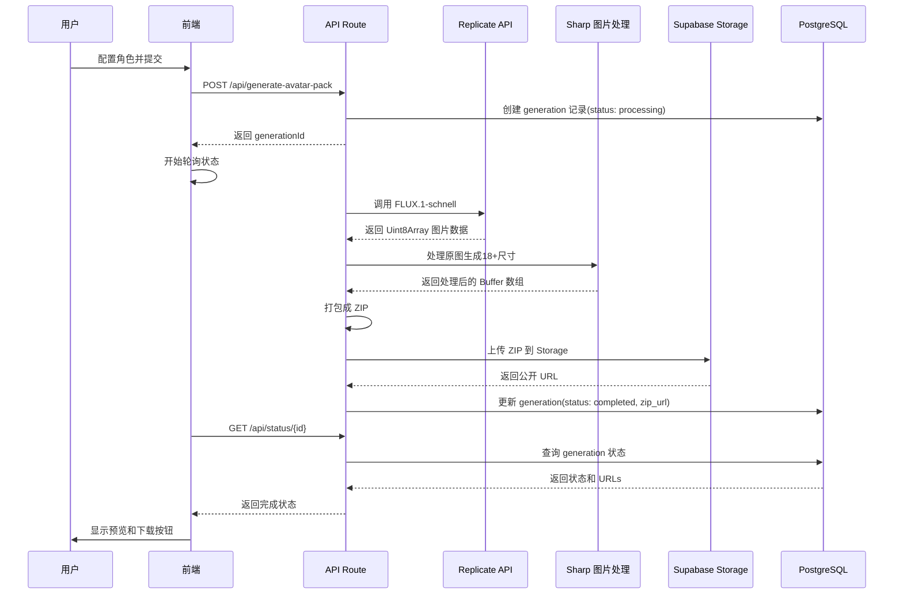
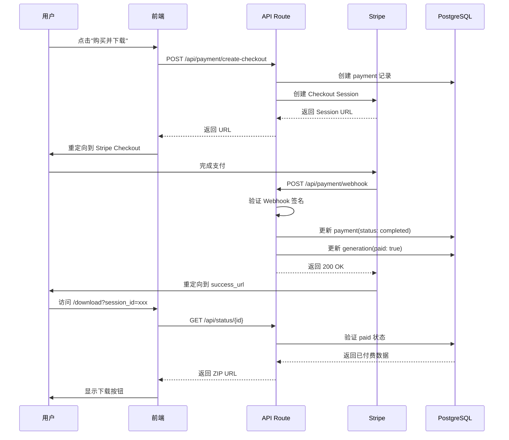

# Genshin Avatar Studio - 技术实现方案

## 📋 文档信息

**项目名称**: Genshin Avatar Studio
**版本**: v1.0 MVP
**架构师**: Technical Team
**最后更新**: 2026-01-12

---

## 🏗️ 系统架构

### 架构概览

```
┌─────────────────────────────────────────────────────────────┐
│                         用户浏览器                            │
│  ┌─────────────────┐  ┌──────────────┐  ┌────────────────┐ │
│  │  配置界面        │  │  预览页面     │  │  下载页面       │ │
│  │  (React)        │  │  (React)     │  │  (React)       │ │
│  └─────────────────┘  └──────────────┘  └────────────────┘ │
└──────────────────┬──────────────────────────────────────────┘
                   │ HTTPS / WebSocket
┌──────────────────▼──────────────────────────────────────────┐
│                    Vercel Edge Network                       │
│  ┌───────────────────────────────────────────────────────┐  │
│  │         Next.js 16 App Router (SSR + API Routes)      │  │
│  └───────────────────────────────────────────────────────┘  │
└──────┬────────────────┬────────────────┬─────────────────────┘
       │                │                │
       │                │                │
   ┌───▼────┐      ┌────▼─────┐    ┌────▼──────┐
   │Replicate│      │ Supabase │    │  Stripe   │
   │  API    │      │ Database │    │  Payment  │
   │(AI生成) │      │ Storage  │    │   API     │
   └─────────┘      └──────────┘    └───────────┘
       │                │
       │                │
   ┌───▼────┐      ┌────▼──────┐
   │ FLUX.1 │      │ PostgreSQL│
   │schnell │      │  + S3     │
   └────────┘      └───────────┘
```

---

## 🔧 技术栈详解

### 前端技术栈

**框架 & 库**:
```json
{
  "next": "16.1.1",
  "react": "19",
  "typescript": "5",
  "tailwindcss": "4",
  "@radix-ui/react-*": "latest",
  "framer-motion": "^12.25.0",
  "lucide-react": "^0.562.0"
}
```

**关键依赖说明**:
- `Next.js 16.1.1`: 使用 App Router，支持 RSC（React Server Components）
- `TailwindCSS 4`: 新版本，性能提升
- `Radix UI`: 无样式、可访问的 UI 组件基础库
- `Framer Motion`: 流畅动画库
- `Lucide React`: 现代图标库

---

### 后端技术栈

**API 层**:
```typescript
// Next.js API Routes
app/api/
├── generate-avatar-pack/
│   └── route.ts          // 主生成 API
├── payment/
│   ├── create-checkout/  // 创建支付
│   └── webhook/          // Stripe Webhook
└── status/
    └── [id]/route.ts     // 查询生成状态
```

**数据库 (Supabase PostgreSQL)**:
```sql
-- generations 表
CREATE TABLE generations (
  id UUID PRIMARY KEY DEFAULT uuid_generate_v4(),
  user_id UUID REFERENCES users(id),
  config JSONB NOT NULL,           -- 用户配置
  images JSONB,                     -- 生成的图片 URLs
  zip_url TEXT,                     -- ZIP 下载链接
  status TEXT NOT NULL,             -- processing/completed/failed
  created_at TIMESTAMP DEFAULT NOW(),
  completed_at TIMESTAMP,
  paid BOOLEAN DEFAULT FALSE,
  payment_id TEXT,
  error_message TEXT
);

-- users 表 (简化版,用于追踪)
CREATE TABLE users (
  id UUID PRIMARY KEY DEFAULT uuid_generate_v4(),
  email TEXT UNIQUE,
  created_at TIMESTAMP DEFAULT NOW(),
  generation_count INT DEFAULT 0,
  total_spent DECIMAL DEFAULT 0
);

-- payments 表
CREATE TABLE payments (
  id UUID PRIMARY KEY DEFAULT uuid_generate_v4(),
  user_id UUID REFERENCES users(id),
  generation_id UUID REFERENCES generations(id),
  stripe_session_id TEXT UNIQUE,
  amount INT NOT NULL,              -- 美分
  status TEXT NOT NULL,             -- pending/completed/failed
  created_at TIMESTAMP DEFAULT NOW(),
  completed_at TIMESTAMP
);
```

**存储 (Supabase Storage)**:
```
Buckets:
├── generated-images/         (PUBLIC)
│   ├── {generationId}/
│   │   ├── avatar.png       (原图)
│   │   └── avatar-pack.zip  (ZIP 包)
```

**文件命名规范**:
- 原图: `{generationId}/avatar.png`
- ZIP 包: `{generationId}/avatar-pack.zip`
- 自动删除策略: 30 天后清理

---

### 第三方服务

**1. Replicate (AI 生成)**
```typescript
// 配置
const REPLICATE_CONFIG = {
  model: 'black-forest-labs/flux-schnell',
  apiToken: process.env.REPLICATE_API_TOKEN,
  timeout: 60000,  // 60秒超时
  retries: 3       // 最多重试3次
}

// 请求参数
const input = {
  prompt: generatedPrompt,
  width: 1024,
  height: 1024,
  num_outputs: 1,
  num_inference_steps: 4,
  output_format: 'png'
}
```

**成本计算**:
- FLUX-schnell: ~$0.003/秒 × 30秒 = $0.10/图
- 月限额: 设置为 $100（防止滥用）

**2. Supabase**
```typescript
// 配置
const SUPABASE_CONFIG = {
  url: process.env.NEXT_PUBLIC_SUPABASE_URL,
  anonKey: process.env.NEXT_PUBLIC_SUPABASE_ANON_KEY,
  serviceRoleKey: process.env.SUPABASE_SERVICE_ROLE_KEY  // 服务端
}

// 存储配置
Storage:
  - Bucket: generated-images (PUBLIC)
  - Max file size: 10MB
  - Allowed types: image/png, application/zip
  - Auto-delete: 30 days
```

**成本计算**:
- 数据库: Pro Plan $25/月（包含 8GB）
- 存储: $0.021/GB/月（预计 5GB = $0.11/月）
- 流量: $0.09/GB（预计 100GB = $9/月）
- **总计**: ~$35/月

**3. Stripe**
```typescript
// 配置
const STRIPE_CONFIG = {
  publishableKey: process.env.NEXT_PUBLIC_STRIPE_PUBLISHABLE_KEY,
  secretKey: process.env.STRIPE_SECRET_KEY,
  webhookSecret: process.env.STRIPE_WEBHOOK_SECRET,
  currency: 'usd',
  mode: 'payment'  // 单次支付
}

// Checkout Session
{
  mode: 'payment',
  line_items: [{
    price_data: {
      currency: 'usd',
      product_data: {
        name: 'Genshin Avatar Pack',
        description: '18+ platform-ready avatars',
        images: [previewImageUrl]
      },
      unit_amount: 1500  // $15.00
    },
    quantity: 1
  }],
  success_url: `${domain}/download?session_id={CHECKOUT_SESSION_ID}`,
  cancel_url: `${domain}/preview?canceled=true`
}
```

**成本**:
- 交易费: 2.9% + $0.30/笔
- $15 收入 → Stripe 收 $0.74 → 净收 $14.26

---

## 📁 项目结构

```
anime-identity-kit/
├── app/
│   ├── (marketing)/           # 营销页面组
│   │   ├── page.tsx           # 首页 Landing Page
│   │   ├── about/             # 关于页面
│   │   ├── pricing/           # 定价页面
│   │   └── examples/          # 示例展示
│   │
│   ├── create/                # 创建器页面
│   │   └── page.tsx           # 角色配置界面
│   │
│   ├── preview/               # 预览页面
│   │   └── page.tsx           # 生成进度 + 预览
│   │
│   ├── download/              # 下载页面
│   │   └── page.tsx           # 支付后下载
│   │
│   ├── api/                   # API 路由
│   │   ├── generate-avatar-pack/
│   │   │   └── route.ts       # 主生成 API
│   │   ├── payment/
│   │   │   ├── create-checkout/
│   │   │   │   └── route.ts   # 创建 Stripe Checkout
│   │   │   └── webhook/
│   │   │       └── route.ts   # Stripe Webhook 处理
│   │   └── status/
│   │       └── [id]/
│   │           └── route.ts   # 查询生成状态
│   │
│   ├── layout.tsx             # 根布局
│   └── globals.css            # 全局样式
│
├── components/
│   ├── ui/                    # shadcn/ui 组件
│   │   ├── button.tsx
│   │   ├── card.tsx
│   │   ├── select.tsx
│   │   └── ...
│   │
│   ├── creator/               # 创建器组件
│   │   ├── ConfigStep.tsx     # 配置步骤
│   │   ├── StyleSelector.tsx  # 风格选择器
│   │   ├── TraitSelector.tsx  # 特征选择器
│   │   └── PreviewPanel.tsx   # 预览面板
│   │
│   ├── generation/            # 生成组件
│   │   ├── ProgressBar.tsx    # 进度条
│   │   ├── StatusIndicator.tsx # 状态指示器
│   │   └── ImageGrid.tsx      # 图片网格
│   │
│   └── shared/                # 共享组件
│       ├── Header.tsx
│       ├── Footer.tsx
│       └── LoadingSpinner.tsx
│
├── lib/
│   ├── image/
│   │   ├── processor.ts       # 图片处理（resize, crop）
│   │   └── packager.ts        # ZIP 打包
│   │
│   ├── prompts/
│   │   └── generator.ts       # Prompt 生成器
│   │
│   ├── replicate/
│   │   └── client.ts          # Replicate API 客户端
│   │
│   ├── supabase/
│   │   ├── client.ts          # 浏览器端客户端
│   │   └── admin.ts           # 服务端客户端
│   │
│   ├── stripe/
│   │   └── client.ts          # Stripe 集成
│   │
│   └── utils/
│       ├── validation.ts      # 配置验证
│       └── helpers.ts         # 工具函数
│
├── types/
│   └── index.ts               # TypeScript 类型定义
│
├── public/
│   ├── images/                # 静态图片
│   ├── examples/              # 示例头像
│   └── favicon.ico
│
├── .env.local                 # 环境变量
├── next.config.ts             # Next.js 配置
├── tailwind.config.ts         # TailwindCSS 配置
├── tsconfig.json              # TypeScript 配置
└── package.json
```

---

## 🔄 核心业务流程

### 1. 头像生成流程



**详细步骤**:

**Step 1: 用户配置 (frontend)**
```typescript
// app/create/page.tsx
const handleSubmit = async (config: AvatarConfig) => {
  // 验证配置
  const validation = validateConfig(config)
  if (!validation.valid) {
    showError(validation.errors)
    return
  }

  // 调用生成 API
  const response = await fetch('/api/generate-avatar-pack', {
    method: 'POST',
    headers: { 'Content-Type': 'application/json' },
    body: JSON.stringify({ config })
  })

  const { generationId } = await response.json()

  // 跳转到预览页面
  router.push(`/preview?id=${generationId}`)
}
```

**Step 2: 服务端生成 (API)**
```typescript
// app/api/generate-avatar-pack/route.ts
export async function POST(request: NextRequest) {
  // 1. 解析配置
  const { config } = await request.json()

  // 2. 创建数据库记录
  const { data: generation } = await supabaseAdmin
    .from('generations')
    .insert({
      config,
      status: 'processing'
    })
    .select()
    .single()

  // 3. AI 生成原图
  const originalImageUrl = await generateImage(
    config,
    'avatar',
    generation.id,
    { width: 1024, height: 1024 }
  )

  // 4. 下载原图到 Buffer
  const imageResponse = await fetch(originalImageUrl)
  const originalImageBuffer = Buffer.from(
    await imageResponse.arrayBuffer()
  )

  // 5. 生成多平台尺寸
  const avatarBuffers = await generateAvatarPack(originalImageBuffer)

  // 6. 生成壁纸
  const wallpaperBuffers = await generateWallpapers(originalImageBuffer)

  // 7. 打包成 ZIP
  const zipBuffer = await createAvatarZip(
    avatarBuffers,
    wallpaperBuffers,
    { generationId: generation.id, style: 'genshin' }
  )

  // 8. 上传 ZIP 到 Supabase
  const zipUrl = await uploadZipToSupabase(
    zipBuffer,
    generation.id,
    supabaseAdmin
  )

  // 9. 更新数据库
  await supabaseAdmin
    .from('generations')
    .update({
      images: { original: originalImageUrl, zip: zipUrl },
      status: 'completed',
      completed_at: new Date().toISOString()
    })
    .eq('id', generation.id)

  return NextResponse.json({
    success: true,
    generationId: generation.id,
    zipUrl
  })
}
```

**Step 3: 前端轮询状态**
```typescript
// app/preview/page.tsx
useEffect(() => {
  const pollStatus = async () => {
    const response = await fetch(`/api/status/${generationId}`)
    const data = await response.json()

    setStatus(data.status)
    setProgress(calculateProgress(data.status))

    if (data.status === 'completed') {
      setZipUrl(data.images.zip)
      clearInterval(intervalId)
    } else if (data.status === 'failed') {
      setError(data.error)
      clearInterval(intervalId)
    }
  }

  const intervalId = setInterval(pollStatus, 2000)  // 每2秒轮询
  return () => clearInterval(intervalId)
}, [generationId])
```

---

### 2. 支付流程



**详细实现**:

**Step 1: 创建 Stripe Checkout**
```typescript
// app/api/payment/create-checkout/route.ts
export async function POST(request: NextRequest) {
  const { generationId } = await request.json()

  // 1. 创建支付记录
  const { data: payment } = await supabaseAdmin
    .from('payments')
    .insert({
      generation_id: generationId,
      amount: 1500,  // $15.00
      status: 'pending'
    })
    .select()
    .single()

  // 2. 创建 Stripe Checkout Session
  const session = await stripe.checkout.sessions.create({
    mode: 'payment',
    line_items: [{
      price_data: {
        currency: 'usd',
        product_data: {
          name: 'Genshin Avatar Pack',
          description: '18+ platform-ready avatars + wallpapers'
        },
        unit_amount: 1500
      },
      quantity: 1
    }],
    metadata: {
      paymentId: payment.id,
      generationId
    },
    success_url: `${process.env.NEXT_PUBLIC_URL}/download?session_id={CHECKOUT_SESSION_ID}`,
    cancel_url: `${process.env.NEXT_PUBLIC_URL}/preview?id=${generationId}&canceled=true`
  })

  // 3. 更新支付记录
  await supabaseAdmin
    .from('payments')
    .update({ stripe_session_id: session.id })
    .eq('id', payment.id)

  return NextResponse.json({ url: session.url })
}
```

**Step 2: Webhook 处理**
```typescript
// app/api/payment/webhook/route.ts
export async function POST(request: NextRequest) {
  const body = await request.text()
  const signature = request.headers.get('stripe-signature')

  // 1. 验证 Webhook 签名
  const event = stripe.webhooks.constructEvent(
    body,
    signature,
    process.env.STRIPE_WEBHOOK_SECRET
  )

  // 2. 处理事件
  if (event.type === 'checkout.session.completed') {
    const session = event.data.object

    // 3. 更新支付状态
    await supabaseAdmin
      .from('payments')
      .update({
        status: 'completed',
        completed_at: new Date().toISOString()
      })
      .eq('stripe_session_id', session.id)

    // 4. 标记 generation 为已付费
    await supabaseAdmin
      .from('generations')
      .update({ paid: true })
      .eq('id', session.metadata.generationId)
  }

  return NextResponse.json({ received: true })
}
```

---

## 🖼️ 图片处理管道

### Prompt 生成策略

**核心 Prompt 结构**:
```typescript
function generatePrompt(config: AvatarConfig): string {
  const parts: string[] = []

  // 1. 风格（最重要）
  parts.push('Genshin Impact style')
  parts.push('anime cel-shaded, vibrant colors')
  parts.push('miHoYo official art style')

  // 2. 一致性标签
  parts.push('same character, consistent character design')
  parts.push('character reference sheet style')

  // 3. 表情
  parts.push('neutral expression, calm and confident')
  parts.push('front-facing portrait')

  // 4. 性别
  parts.push(config.gender === 'male'
    ? 'male character, masculine features'
    : 'female character, feminine features')

  // 5. 发型 + 发色
  parts.push(`${config.hairColor} hair`)
  parts.push(`${config.hairStyle} hairstyle`)

  // 6. 眼睛颜色
  parts.push(`${config.eyeColor} eyes, expressive eyes`)

  // 7. 特殊特征
  if (config.traits.length > 0) {
    parts.push(config.traits.map(t => TRAIT_PROMPTS[t]).join(', '))
  }

  // 8. 构图
  parts.push('bust shot, from chest up')
  parts.push('centered composition, white background')
  parts.push('front view, looking at viewer')

  // 9. 质量词
  parts.push('masterpiece, best quality, highly detailed, sharp focus')
  parts.push('consistent lighting, professional character design')

  return parts.join(', ')
}
```

**示例输出**:
```
"Genshin Impact style, anime cel-shaded, vibrant colors, miHoYo official art style, same character, consistent character design, character reference sheet style, neutral expression, calm and confident, front-facing portrait, female character, feminine features, blonde hair, twin tails hairstyle, blue eyes, expressive eyes, cat ears, neko features, bust shot, from chest up, centered composition, white background, front view, looking at viewer, masterpiece, best quality, highly detailed, sharp focus, consistent lighting, professional character design"
```

---

### Sharp 图片处理

**圆形裁剪实现**:
```typescript
// lib/image/processor.ts
async function createCircleMask(size: number): Promise<Buffer> {
  const svg = `
    <svg width="${size}" height="${size}">
      <circle cx="${size/2}" cy="${size/2}" r="${size/2}" fill="white"/>
    </svg>
  `
  return Buffer.from(svg)
}

async function processAvatar(
  inputBuffer: Buffer,
  platform: PlatformSpec
): Promise<Buffer> {
  let image = sharp(inputBuffer)

  // 1. Resize 到目标尺寸
  image = image.resize(platform.size, platform.size, {
    fit: 'cover',
    position: 'center'
  })

  // 2. 圆形裁剪
  if (platform.shape === 'circle') {
    const mask = await createCircleMask(platform.size)
    image = image.composite([{
      input: mask,
      blend: 'dest-in'
    }])
  }

  // 3. 输出 PNG
  return image.png({ quality: 95 }).toBuffer()
}
```

**批量处理**:
```typescript
async function generateAvatarPack(
  originalImageBuffer: Buffer
): Promise<Record<string, Buffer>> {
  const results: Record<string, Buffer> = {}

  // 并行处理所有平台尺寸
  const promises = Object.entries(PLATFORM_SPECS).map(async ([key, spec]) => {
    const buffer = await processAvatar(originalImageBuffer, spec)
    results[key] = buffer
  })

  await Promise.all(promises)

  return results
}
```

---

## ⚡ 性能优化

### 1. 缓存策略

**Vercel Edge 缓存**:
```typescript
// next.config.ts
const nextConfig = {
  headers: async () => [
    {
      source: '/api/status/:path*',
      headers: [
        {
          key: 'Cache-Control',
          value: 'public, s-maxage=10, stale-while-revalidate=30'
        }
      ]
    }
  ]
}
```

**前端缓存**:
```typescript
// SWR 配置
import useSWR from 'swr'

const { data, error } = useSWR(
  `/api/status/${generationId}`,
  fetcher,
  {
    refreshInterval: 2000,  // 每2秒刷新
    revalidateOnFocus: false
  }
)
```

---

### 2. 图片优化

**Next.js Image 组件**:
```typescript
<Image
  src={zipUrl}
  alt="Generated Avatar"
  width={512}
  height={512}
  priority
  placeholder="blur"
  blurDataURL={lowResBlur}
/>
```

**懒加载**:
```typescript
// 缩略图网格懒加载
const ImageGrid = () => {
  return (
    <div className="grid grid-cols-4 gap-4">
      {images.map((img, i) => (
        <Image
          key={i}
          src={img}
          loading="lazy"  // 懒加载
          width={200}
          height={200}
        />
      ))}
    </div>
  )
}
```

---

### 3. API 优化

**并行处理**:
```typescript
// 并行生成多个尺寸
const [avatarBuffers, wallpaperBuffers] = await Promise.all([
  generateAvatarPack(originalImageBuffer),
  generateWallpapers(originalImageBuffer)
])
```

**流式处理**:
```typescript
// Replicate 返回的流式数据
for await (const chunk of output as AsyncIterable<any>) {
  if (chunk instanceof Uint8Array) {
    chunks.push(chunk)
  }
}
```

---

## 🔒 安全措施

### 1. API 限流

**Vercel Edge Config**:
```typescript
// middleware.ts
import { Ratelimit } from '@upstash/ratelimit'
import { Redis } from '@upstash/redis'

const ratelimit = new Ratelimit({
  redis: Redis.fromEnv(),
  limiter: Ratelimit.slidingWindow(10, '1 h'),  // 10次/小时
  analytics: true
})

export async function middleware(request: NextRequest) {
  const ip = request.ip ?? '127.0.0.1'
  const { success } = await ratelimit.limit(ip)

  if (!success) {
    return NextResponse.json(
      { error: 'Too many requests' },
      { status: 429 }
    )
  }

  return NextResponse.next()
}
```

---

### 2. 输入验证

**Zod 验证**:
```typescript
import { z } from 'zod'

const ConfigSchema = z.object({
  gender: z.enum(['male', 'female']),
  hairStyle: z.enum(['long', 'short', 'ponytail', 'twintails', 'braid']),
  hairColor: z.enum(['black', 'brown', 'blonde', 'silver', 'white', 'red', 'pink', 'blue', 'purple', 'green']),
  eyeColor: z.enum(['blue', 'green', 'brown', 'red', 'purple', 'gold', 'pink']),
  traits: z.array(z.enum(['glasses', 'eyepatch', 'elf-ears', 'horns', 'wings', 'cat-ears']))
})

// 使用
const config = ConfigSchema.parse(requestBody)
```

---

### 3. 环境变量保护

**.env.local**:
```bash
# Replicate
REPLICATE_API_TOKEN=r8_xxx...

# Supabase
NEXT_PUBLIC_SUPABASE_URL=https://xxx.supabase.co
NEXT_PUBLIC_SUPABASE_ANON_KEY=eyJxxx...
SUPABASE_SERVICE_ROLE_KEY=eyJxxx...  # 仅服务端

# Stripe
NEXT_PUBLIC_STRIPE_PUBLISHABLE_KEY=pk_test_xxx...
STRIPE_SECRET_KEY=sk_test_xxx...     # 仅服务端
STRIPE_WEBHOOK_SECRET=whsec_xxx...   # 仅服务端

# App
NEXT_PUBLIC_URL=https://genshin-avatar.studio
```

**验证**:
```typescript
// lib/utils/env.ts
const requiredEnvVars = [
  'REPLICATE_API_TOKEN',
  'NEXT_PUBLIC_SUPABASE_URL',
  'SUPABASE_SERVICE_ROLE_KEY',
  'STRIPE_SECRET_KEY'
]

requiredEnvVars.forEach(key => {
  if (!process.env[key]) {
    throw new Error(`Missing required env var: ${key}`)
  }
})
```

---

## 📊 监控与日志

### 1. 日志策略

**结构化日志**:
```typescript
// lib/utils/logger.ts
export const logger = {
  info: (message: string, meta?: any) => {
    console.log(JSON.stringify({
      level: 'info',
      message,
      ...meta,
      timestamp: new Date().toISOString()
    }))
  },

  error: (message: string, error: any, meta?: any) => {
    console.error(JSON.stringify({
      level: 'error',
      message,
      error: error.message,
      stack: error.stack,
      ...meta,
      timestamp: new Date().toISOString()
    }))
  }
}

// 使用
logger.info('Image generated', {
  generationId,
  duration: Date.now() - startTime
})
```

---

### 2. 错误追踪

**Sentry 集成**（可选）:
```typescript
// sentry.client.config.ts
import * as Sentry from '@sentry/nextjs'

Sentry.init({
  dsn: process.env.NEXT_PUBLIC_SENTRY_DSN,
  tracesSampleRate: 0.1,
  environment: process.env.NODE_ENV
})
```

---

## 🚀 部署流程

### 1. Vercel 部署

**vercel.json**:
```json
{
  "buildCommand": "npm run build",
  "devCommand": "npm run dev",
  "installCommand": "npm install",
  "framework": "nextjs",
  "regions": ["iad1"],
  "env": {
    "NEXT_PUBLIC_URL": "https://genshin-avatar.studio"
  }
}
```

**部署步骤**:
```bash
# 1. 连接 Vercel
vercel link

# 2. 设置环境变量
vercel env add REPLICATE_API_TOKEN
vercel env add SUPABASE_SERVICE_ROLE_KEY
vercel env add STRIPE_SECRET_KEY
vercel env add STRIPE_WEBHOOK_SECRET

# 3. 部署
vercel --prod
```

---

### 2. Supabase 设置

**初始化数据库**:
```bash
# 1. 创建表
supabase db push

# 2. 创建 Storage Bucket
supabase storage create generated-images --public

# 3. 设置 RLS 策略
supabase db push --include-roles
```

---

### 3. Stripe Webhook 设置

**步骤**:
1. 登录 Stripe Dashboard
2. 进入 Developers → Webhooks
3. 添加 endpoint: `https://genshin-avatar.studio/api/payment/webhook`
4. 选择事件: `checkout.session.completed`
5. 复制 Webhook Secret 到环境变量

---

## ✅ 测试策略

### 1. 单元测试

```typescript
// __tests__/lib/prompts/generator.test.ts
import { generatePrompt } from '@/lib/prompts/generator'

describe('Prompt Generator', () => {
  it('should generate valid Genshin prompt', () => {
    const config = {
      gender: 'female',
      hairStyle: 'twintails',
      hairColor: 'blonde',
      eyeColor: 'blue',
      traits: ['cat-ears']
    }

    const prompt = generatePrompt(config, 'avatar')

    expect(prompt).toContain('Genshin Impact style')
    expect(prompt).toContain('blonde hair')
    expect(prompt).toContain('cat ears')
  })
})
```

---

### 2. 集成测试

```typescript
// __tests__/api/generate.test.ts
import { POST } from '@/app/api/generate-avatar-pack/route'

describe('Generate Avatar Pack API', () => {
  it('should create generation record', async () => {
    const request = new Request('http://localhost:3000/api/generate-avatar-pack', {
      method: 'POST',
      body: JSON.stringify({ config: validConfig })
    })

    const response = await POST(request)
    const data = await response.json()

    expect(response.status).toBe(200)
    expect(data.generationId).toBeDefined()
  })
})
```

---

### 3. E2E 测试

**Playwright 配置**:
```typescript
// e2e/avatar-generation.spec.ts
import { test, expect } from '@playwright/test'

test('complete avatar generation flow', async ({ page }) => {
  // 1. 访问创建页面
  await page.goto('http://localhost:3000/create')

  // 2. 配置角色
  await page.selectOption('[name="gender"]', 'female')
  await page.selectOption('[name="hairStyle"]', 'twintails')
  await page.selectOption('[name="hairColor"]', 'blonde')

  // 3. 提交
  await page.click('button[type="submit"]')

  // 4. 等待预览页面
  await page.waitForURL(/\/preview/)

  // 5. 验证生成完成
  await expect(page.locator('.download-button')).toBeVisible({
    timeout: 120000  // 2分钟超时
  })
})
```

---

## 📝 开发工作流

### 本地开发

```bash
# 1. 克隆项目
git clone https://github.com/yourname/genshin-avatar-studio.git
cd genshin-avatar-studio

# 2. 安装依赖
npm install

# 3. 设置环境变量
cp .env.example .env.local
# 编辑 .env.local 填入真实 API keys

# 4. 初始化数据库
npm run db:push

# 5. 启动开发服务器
npm run dev
```

---

### Git 工作流

**分支策略**:
```
main            # 生产环境
├── develop     # 开发环境
│   ├── feature/avatar-generation
│   ├── feature/payment-integration
│   └── fix/image-quality
```

**提交规范**:
```bash
feat: 添加圆形头像裁剪功能
fix: 修复 ZIP 下载失败问题
docs: 更新 API 文档
perf: 优化图片处理性能
test: 添加 Prompt 生成器测试
```

---

## 🎯 下一步行动

### 立即开始（今天）

- [ ] 创建 Vercel 项目
- [ ] 设置 Supabase 项目
- [ ] 获取 Replicate API Token
- [ ] 注册 Stripe 账号

### Week 1

- [ ] 优化 Genshin Prompt
- [ ] 实现图片处理管道
- [ ] 完成前端配置界面
- [ ] 集成支付功能

### Week 2

- [ ] 内部测试（10次生成）
- [ ] 修复 Bug
- [ ] 性能优化
- [ ] 准备 Beta 发布

---

**文档结束**

如需技术支持或澄清，请联系技术团队。
